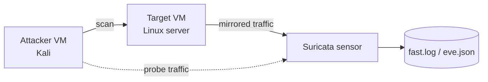

# Security Lab


Hands-on network security lab notes and tooling: **reconnaissance with Nmap**, **intrusion detection with Suricata**, and a small utility that turns raw Nmap XML into a readable Markdown report.

Built from my network security coursework and home-lab practice at CUHK.

> **Ethics first.** Only scan systems you own or have explicit written permission to test. Every command here was run against my own isolated lab network.

---

## Contents

| Path | What it is |
| --- | --- |
| [`docs/01-recon-with-nmap.md`](docs/01-recon-with-nmap.md) | Reconnaissance methodology, commands, and how to read output |
| [`docs/02-intrusion-detection-with-suricata.md`](docs/02-intrusion-detection-with-suricata.md) | IDS setup, rule basics, generating and triaging alerts |
| [`scripts/nmap_xml_to_markdown.py`](scripts/nmap_xml_to_markdown.py) | Convert `nmap -oX` XML output into a Markdown report |
| [`samples/sample_nmap.xml`](samples/sample_nmap.xml) | Sanitised sample scan used by the tests |

## Quick start

```bash
# Turn a scan into a shareable report
python scripts/nmap_xml_to_markdown.py samples/sample_nmap.xml --output report.md

# Or print to stdout
python scripts/nmap_xml_to_markdown.py samples/sample_nmap.xml
```

```markdown
# Nmap Scan Report

**Command:** `nmap -sV -T4 10.10.0.0/24`

**Hosts discovered:** 3

## 10.10.0.5 (web.lab.local)

| Port | Protocol | State | Service | Version |
| --- | --- | --- | --- | --- |
| 22 | tcp | open | ssh | OpenSSH 9.6 |
| 443 | tcp | open | https | nginx 1.24 |
```

## Lab topology



## Tests

```bash
python -m unittest discover -s tests -v
```

## Author

**HeiChan (Chan Hei Lun)** — BEng in Information Engineering, CUHK
[github.com/ChanHei419](https://github.com/ChanHei419)
